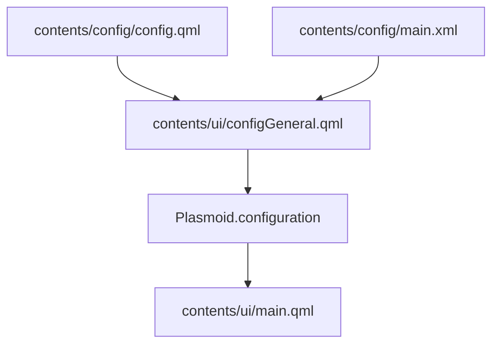
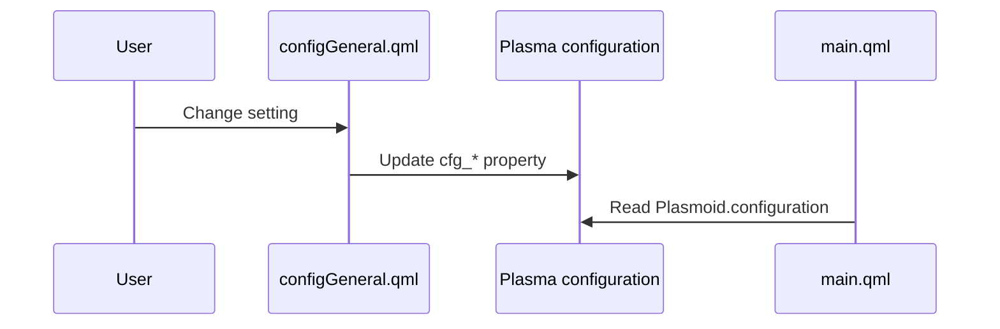

<!-- Last scan: 2026-04-30 -->

# Configuration

Configuration connects Plasma's settings UI to the persisted KConfig entries consumed by the widget runtime. It is intentionally small: one config category, one Kirigami form, and one XML schema.

## Responsibility

Owns user-adjustable settings, their default values, and the settings page layout. It does not own the runtime behavior that consumes those settings.

## Architecture

## Key Files

- `contents/config/config.qml` - Declares the General config category
- `contents/config/main.xml` - KConfig schema and defaults
- `contents/ui/configGeneral.qml` - Kirigami settings UI
- `contents/ui/Translations.qml` - Supplies translated labels for settings controls

## Key Interfaces / Types

- `contents/config/config.qml:ConfigCategory` - Registers the "General" settings page and points Plasma to `configGeneral.qml`.
- `contents/config/main.xml:General` - Defines persisted keys, types, labels, and defaults.
- `contents/ui/configGeneral.qml:cfg_*` - Plasma-bound properties that mirror `main.xml` entries.
- `contents/ui/configGeneral.qml:tr()` - Local helper that routes settings labels through `Translations.qml`.

## Flows

### Settings Save

## Configuration

| Key | Type | Default | Runtime consumer |
|-----|------|---------|------------------|
| `language` | String | `system` | `contents/ui/Translations.qml:getEffectiveLanguage()` |
| `refreshInterval` | Int | `5` | `contents/ui/main.qml:refreshTimer` |
| `panelLayout` | String | `horizontal` | `contents/ui/main.qml:isVerticalLayout` |
| `showIcon` | Bool | `true` | `contents/ui/main.qml:compactRepresentation` |
| `panelStyle` | String | `text` | `contents/ui/main.qml:compactRepresentation` |
| `showSession` | Bool | `true` | Panel metric visibility and tooltip |
| `showWeekly` | Bool | `true` | Panel metric visibility and tooltip |
| `showSonnet` | Bool | `false` | Panel metric visibility and tooltip |
| `baseUrl` | String | empty | `contents/ui/main.qml:loadCredentials()` |
| `apiKey` | String | empty | `contents/ui/main.qml:fetchUsageFromApi()` |
| `accountSwitchCommand` | String | empty | `contents/ui/main.qml:loadAccountSwitchAccounts()` |
| `backgroundOpacity` | Double | `1.0` | Desktop-only background rectangle |

## Dependencies

- **Internal:** [Widget UI](../widget-ui/)
- **External:** KDE KCM/Kirigami config components

## Error Handling

- The settings UI warns when `refreshInterval < 5` because the API allows only a small number of requests per 5-minute window.
- `apiKey` input is disabled until `baseUrl` is non-empty, matching runtime custom API mode.
- `accountSwitchCommand` is optional; empty settings auto-detect the installed `claude-swap` command, while a value points to a compatible wrapper command.
- The runtime still validates missing `apiKey` and reports "API key not configured" because config UI cannot enforce all saved states.

## Related Documents

- [High-Level Design](../high-level-design.md)
- [Data Model](../data-model.md)
