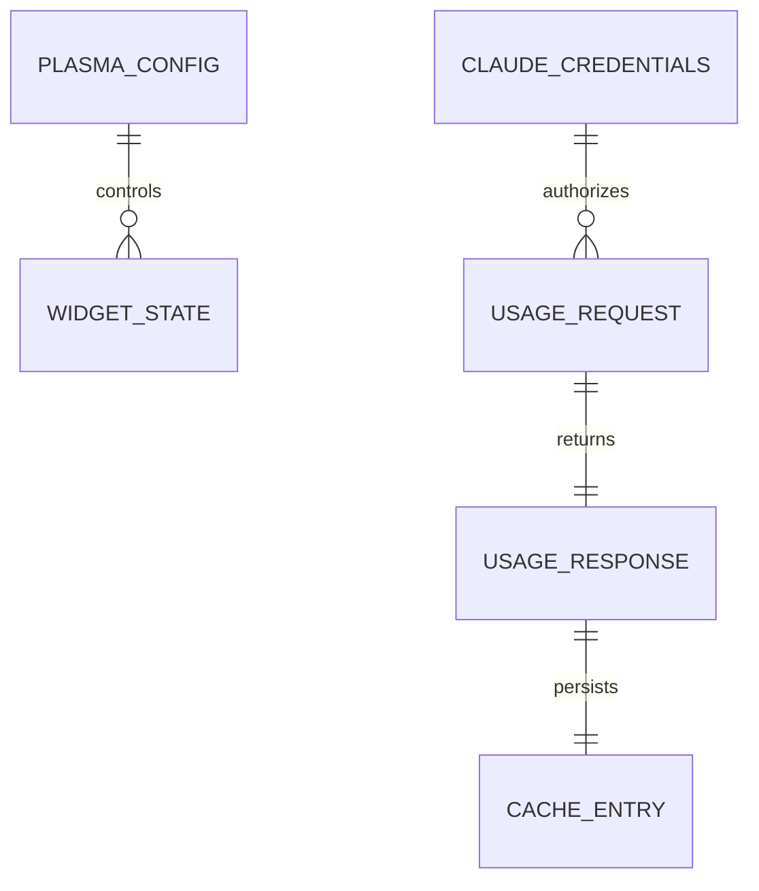

<!-- Last scan: 2026-04-30 -->

# Data Model

The project has no database. Its durable state is Plasma configuration plus a local cache JSON file; runtime data comes from Claude Code OAuth credentials and the `/api/oauth/usage` response.

## Entity Relationship

## Tables / Collections

### Plasma Configuration

- **Defined in:** `contents/config/main.xml`

| Field | Type | Default | Purpose |
|-------|------|---------|---------|
| `language` | String | `system` | Translation selection |
| `refreshInterval` | Int | `5` | Polling interval in minutes |
| `panelLayout` | String | `horizontal` | Panel metric layout direction |
| `showIcon` | Bool | `true` | Claude icon visibility in panel |
| `panelStyle` | String | `text` | Compact display mode: text, circular, or bar |
| `showSession` | Bool | `true` | Session metric visibility |
| `showWeekly` | Bool | `true` | Weekly metric visibility |
| `showSonnet` | Bool | `false` | Sonnet weekly metric visibility |
| `baseUrl` | String | empty | Optional custom API root URL |
| `apiKey` | String | empty | Optional custom API key |
| `accountSwitchCommand` | String | `cswap` | Command used for optional account switching |
| `backgroundOpacity` | Double | `1.0` | Desktop background opacity |

### Claude Code Credentials

- **Read from:** `$HOME/.claude/.credentials.json`

| Field | Source path | Runtime use |
|-------|-------------|-------------|
| `accessToken` | `claudeAiOauth.accessToken` | Bearer token for default API mode |
| `rateLimitTier` | `claudeAiOauth.rateLimitTier` | Maps to `Pro`, `Max 5x`, `Max 20x`, or raw tier label |

Other credential fields may exist, but the widget only reads the fields above -> `contents/ui/main.qml:fileReader`.

### Usage API Response

- **Consumed in:** `contents/ui/main.qml`

| Field | Runtime property | Purpose |
|-------|------------------|---------|
| `five_hour.utilization` | `sessionUsagePercent` | Session usage percent |
| `five_hour.resets_at` | `sessionResetTime`, `sessionReset` | Session reset timestamp/label |
| `seven_day.utilization` | `weeklyUsagePercent` | Weekly usage percent |
| `seven_day.resets_at` | `weeklyResetTime`, `weeklyReset` | Weekly reset timestamp/label |
| `seven_day_sonnet.utilization` | `sonnetWeeklyPercent` | Sonnet weekly model usage |
| `seven_day_opus.utilization` | `opusWeeklyPercent` | Opus weekly model usage |

### Local Cache

- **Written to:** `$HOME/.local/share/claude-usage-cache.json`

| Field | Purpose |
|-------|---------|
| `session`, `weekly`, `sonnet`, `opus` | Cached percentages |
| `hasSonnet`, `hasOpus` | Cached model breakdown availability |
| `plan` | Cached plan badge text |
| `sessionReset`, `weeklyReset` | Cached reset labels |
| `sessionResetTs`, `weeklyResetTs` | Cached reset timestamps |
| `timestamp` | Cache write time; ignored after 24 hours |

## Indexes

- Not applicable.

## Migrations

- Not applicable.

## Related Documents

- [Widget UI](widget-ui/)
- [Configuration](configuration/)
