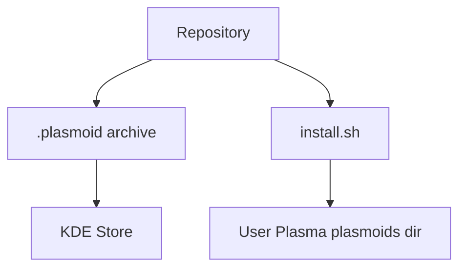

<!-- Last scan: 2026-04-30 -->

# Deployment

The widget is deployed as a KDE Plasma applet. Distribution paths are the [KDE Store page](https://store.kde.org/p/2357774), KPackage installation, the checked-in `.plasmoid` archive, or the local `install.sh` helper.

## Build

```bash
zip -r claude-usage-switcher.plasmoid metadata.json contents/
```

## Run Locally

```bash
./install.sh
kquitapp6 plasmashell && kstart plasmashell
```

## Environment

| Requirement | Purpose |
|-------------|---------|
| KDE Plasma 6.0 or later | Required by `metadata.json:X-Plasma-API-Minimum-Version` |
| Claude Code CLI | Supplies default OAuth credentials and version-based User-Agent |
| `$HOME/.claude/.credentials.json` | Default OAuth credential source |
| `$HOME/.local/share/plasma/plasmoids/` | Local install target used by `install.sh` |
| `$HOME/.local/share/claude-usage-cache.json` | Runtime cache target |

## Infrastructure



## CI/CD

- No CI/CD workflow is present in the repository.
- Release packaging is documented in `README.md`: create the `.plasmoid` archive with `zip -r claude-usage-switcher.plasmoid metadata.json contents/`, then upload to the [KDE Store page](https://store.kde.org/p/2357774).

## Monitoring

- Runtime logs: `journalctl --user -f | grep -i claude`
- Plasma restart after local install: `kquitapp6 plasmashell && kstart plasmashell`
- User-facing troubleshooting is in `README.md`.

## Related Documents

- [Package Assets](package-assets/)
- [Widget UI](widget-ui/)
