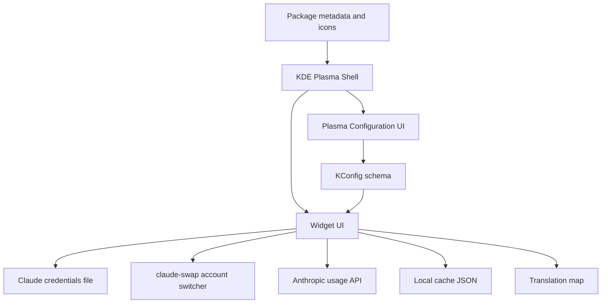
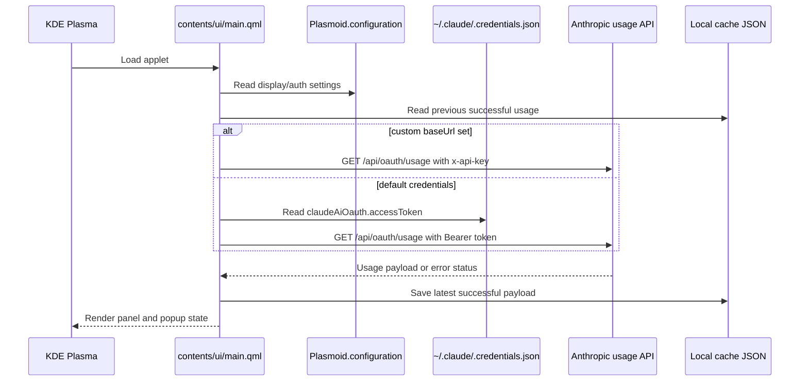

<!-- Last scan: 2026-04-30 -->

# High-Level Design

Claude Account Usage is a KDE Plasma 6 applet based on the original [plasma-claude-usage](https://github.com/izll/plasma-claude-usage) widget. It is implemented in QML. The runtime is a single `PlasmoidItem` that reads Claude Code credentials or custom API settings, calls the Anthropic usage endpoint, caches the last successful response, and renders panel plus popup views.

## Architecture Overview

## Components

- **Widget UI** - Runtime state, polling, auth, API calls, cache handling, rendering, and tooltips -> `contents/ui/main.qml`, `contents/ui/Translations.qml`
- **Configuration** - Plasma settings category, Kirigami form controls, and persisted defaults -> `contents/config/config.qml`, `contents/ui/configGeneral.qml`, `contents/config/main.xml`
- **Package Assets** - KPackage metadata, package archive, install helper, icon theme assets, and screenshots -> `metadata.json`, `claude-account-usage.plasmoid`, `install.sh`, `contents/icons/`, `screenshots/`

## Key Design Decisions

- **Pure QML runtime:** The widget avoids bundled native helpers and uses `Plasma5Support.DataSource` executable commands plus `XMLHttpRequest` in `contents/ui/main.qml`.
- **Credential fallback model:** Empty `baseUrl` means "read Claude Code OAuth credentials"; configured `baseUrl` switches to API-key auth for proxy/gateway users.
- **Optional account switching:** In OAuth mode, the popup can call an installed `claude-swap` command to list, add, and switch Claude Code accounts, then reload credentials.
- **Rate-limit resilience:** The runtime respects `retry-after` when present and falls back to capped 5/10/15 minute backoff while dimming stale data.
- **Local cache-first startup:** Cached usage data under `$HOME/.local/share/claude-usage-cache.json` can populate the UI before the next successful API call.

## Data Flow

## Cross-Cutting Concerns

- **Authentication:** OAuth token from `$HOME/.claude/.credentials.json` by default; `x-api-key` when `baseUrl` is configured -> `contents/ui/main.qml:loadCredentials()`, `contents/ui/main.qml:fetchUsageFromApi()`
- **Account switching:** Optional `claude-swap --list`, `claude-swap --add-account`, and `claude-swap --switch-to` integration is treated as an external command; the widget never reads `claude-swap` storage directly.
- **Rate limits:** 429 responses set `hasRateLimitError`, read `retry-after`, start `rateLimitRetryTimer`, and pause the normal refresh timer -> `contents/ui/main.qml:rateLimitBackoffMs`
- **Internationalization:** A QML translation table maps configured language or system locale to 15 supported locales -> `contents/ui/Translations.qml:tr()`
- **Error handling:** Separate UI states cover missing login/config, token expiry, invalid API key, endpoint not found, parse errors, generic API errors, and rate limits -> `contents/ui/main.qml:fetchUsageFromApi()`
- **Observability:** Runtime logging uses `console.log`, and user docs point to `journalctl --user -f | grep -i claude`.

## Related Documents

- [Widget UI](widget-ui/)
- [Configuration](configuration/)
- [Package Assets](package-assets/)
- [Data Model](data-model.md)
- [Deployment](deployment.md)
- [Rationale](rationale.md)
