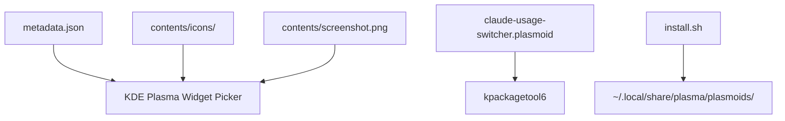
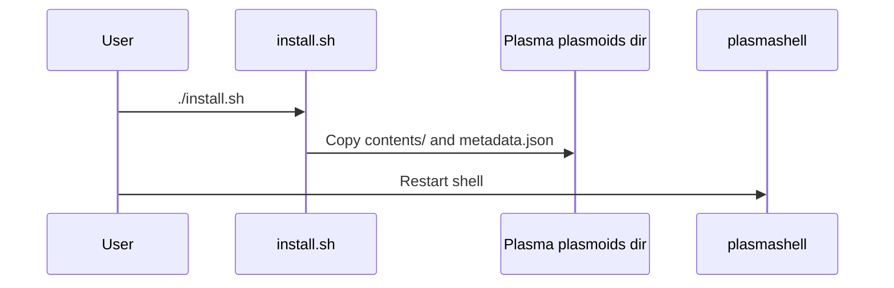

<!-- Last scan: 2026-04-30 -->

# Package Assets

Package assets define how Plasma discovers, installs, previews, and displays the widget outside the runtime QML logic.

## Responsibility

Owns KDE metadata, icon files, package archive inputs, preview screenshots, and local installation script. It does not own widget runtime behavior.

## Architecture

## Key Files

- `metadata.json` - KPackage metadata, plugin id, version, icon, license
- `install.sh` - Copies package files into the local Plasma plasmoids directory
- `claude-usage-switcher.plasmoid` - Packaged widget archive
- `contents/icons/` - Runtime and package icons
- `contents/screenshot.png`, `screenshots/` - Widget picker and README screenshots
- `README.md` - User-facing install, configuration, troubleshooting, and changelog

## Key Interfaces / Types

- `metadata.json:KPlugin.Id` - Plasma plugin id: `org.kde.plasma.claudeusageswitcher`.
- `metadata.json:KPlugin.Version` - Published widget version: `1.3.6`.
- `metadata.json:X-Plasma-API-Minimum-Version` - Requires Plasma API `6.0`.
- `install.sh:PLUGIN_ID` - Must stay aligned with `metadata.json:KPlugin.Id`.
- `contents/ui/main.qml:Component.onCompleted` - Copies `claude-usage-widget.svg` into the user icon theme for Plasma about/picker surfaces.

## Flows

### Local Install

## Configuration

- Plugin id: `org.kde.plasma.claudeusageswitcher`
- KPackage structure: `Plasma/Applet`
- Minimum Plasma API: `6.0`
- License: `GPL-3.0-or-later`
- Category: `System Information`
- Display name: `Claude Usage Switcher`
- Website: `https://github.com/ark3us/plasma-claude-usage`
- Original widget credit: `https://github.com/izll/plasma-claude-usage`
- Account switching credit: `https://github.com/realiti4/claude-swap`
- Local author credit: `https://github.com/ark3us/plasma-claude-usage`

## Dependencies

- **Internal:** [Widget UI](../widget-ui/), [Configuration](../configuration/)
- **External:** KDE KPackage tooling, KDE Store

## Error Handling

- `install.sh` assumes local filesystem install and tells the user to restart Plasma; it does not validate `kpackagetool6`.
- The runtime icon installer redirects command errors to `/dev/null`, so icon install failures should be diagnosed through Plasma widget picker/about behavior rather than runtime logs.

## Related Documents

- [High-Level Design](../high-level-design.md)
- [Deployment](../deployment.md)
