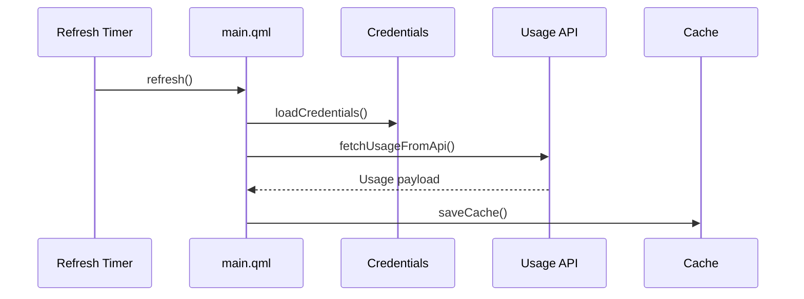
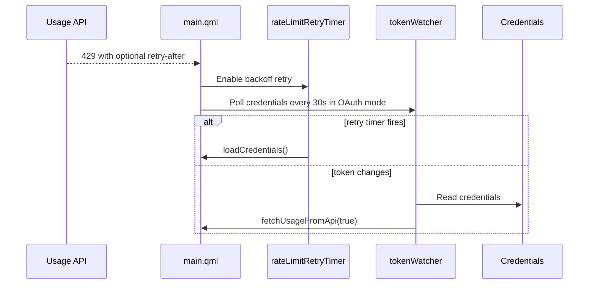
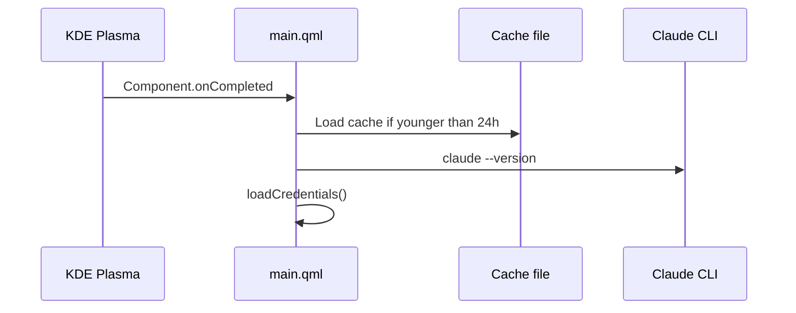

<!-- Last scan: 2026-04-30 -->

# Widget UI

The widget UI is the core applet runtime. It owns credential loading, API polling, cache persistence, rate-limit recovery, usage state, panel rendering, popup rendering, and translated strings.

## Responsibility

Owns all live applet state and user-visible behavior inside Plasma. It reads configuration but does not define persisted setting defaults; those belong to [Configuration](../configuration/).

## Architecture

```mermaid
graph TD
    Main[contents/ui/main.qml] --> Translations[contents/ui/Translations.qml]
    Main --> Config[Plasmoid.configuration]
    Main --> Creds[~/.claude/.credentials.json]
    Main --> API[/api/oauth/usage]
    Main --> Cache[~/.local/share/claude-usage-cache.json]
Main --> Claude[claude --version and claude launcher]
Main --> Cswap[cswap account switcher]
    Main --> Icons[Icon theme installer]
    Main --> Plasma[Plasma panel and popup]
```

## Key Files

- `contents/ui/main.qml` - Runtime state, API access, cache handling, compact representation, and popup UI
- `contents/ui/Translations.qml` - In-QML translation lookup
- `contents/icons/claude.svg` - Icon used by the widget UI
- `contents/icons/claude-usage-widget.svg` - Icon installed into the user icon theme for Plasma about/picker surfaces

## Key Interfaces / Types

- `contents/ui/main.qml:loadCredentials()` - Selects custom API-key mode or default Claude Code OAuth credential mode.
- `contents/ui/main.qml:fetchUsageFromApi()` - Calls `/api/oauth/usage`, parses success payloads, and maps HTTP errors into UI state.
- `contents/ui/main.qml:saveCache()` - Persists the last successful usage snapshot to a local JSON cache.
- `contents/ui/main.qml:loadAccountSwitchAccounts()` - Reads `cswap --list` output for the popup account selector.
- `contents/ui/main.qml:switchAccount()` - Runs `cswap --switch-to` and refreshes credentials and usage.
- `contents/ui/main.qml:addCurrentAccount()` - Runs `cswap --add-account` for the currently logged-in Claude account.
- `contents/ui/main.qml:loginAndAddAccount()` - Opens a terminal for interactive `claude auth login`, then runs `cswap --add-account`.
- `contents/ui/main.qml:refresh()` - Clears token/rate-limit state and starts a new credential/API cycle.
- `contents/ui/accountSwitching.js:parseCswapList()` - Parses account rows from `cswap --list` output.
- `contents/ui/main.qml:drawCircularProgress()` - Shared Canvas drawing helper for compact circular panel style.
- `contents/ui/main.qml:getUsageColor()` - Maps usage thresholds to Plasma theme colors.
- `contents/ui/main.qml:formatTimeRemaining()` - Formats reset countdown labels.
- `contents/ui/Translations.qml:tr()` - Resolves strings from configured language, system locale, English fallback, or source text.

## Flows

### Usage Refresh



### Rate-Limit Recovery



### Startup



## Configuration

| Setting | Runtime use |
|---------|-------------|
| `language` | Chooses translation table or system locale fallback |
| `refreshInterval` | Normal polling interval; values under 5 minutes show a warning |
| `panelLayout` | Switches compact panel between horizontal and vertical `GridLayout` |
| `panelStyle` | Chooses text, circular Canvas, or bar display |
| `showSession`, `showWeekly`, `showSonnet`, `showIcon` | Controls compact panel and tooltip metrics |
| `baseUrl`, `apiKey` | Switches from OAuth credentials to custom API-key mode |
| `accountSwitchCommand` | Command prefix for cswap-compatible account switching |
| `backgroundOpacity` | Applies only when the widget is placed on the desktop, not in a panel |

## Dependencies

- **Internal:** [Configuration](../configuration/), [Package Assets](../package-assets/)
- **External:** KDE Plasma/Kirigami runtime, Claude Code credentials, Claude CLI, optional `cswap`, Anthropic usage API, optional custom API gateway

## Error Handling

- Missing credentials or malformed credential JSON sets "Not logged in" state.
- Missing or unparsable `cswap --list` output, or failed `cswap --add-account`, shows an account-switching error without blocking usage polling.
- Missing custom API key sets "API key not configured" state.
- HTTP 401 maps to "Invalid API key" in custom API mode or token-expired state in OAuth mode.
- HTTP 404 maps to "Endpoint not found" in custom API mode, otherwise generic API error.
- HTTP 429 enables rate-limit state, reads `retry-after`, and uses capped retry backoff.
- JSON parse failures set "Parse error"; other non-200 statuses show a generic API error with status code.
- Cached data is ignored after 24 hours and marked stale after either `retry-after + 60s` or three refresh intervals.

## Related Documents

- [High-Level Design](../high-level-design.md)
- [Data Model](../data-model.md)
- [Rationale](../rationale.md)
